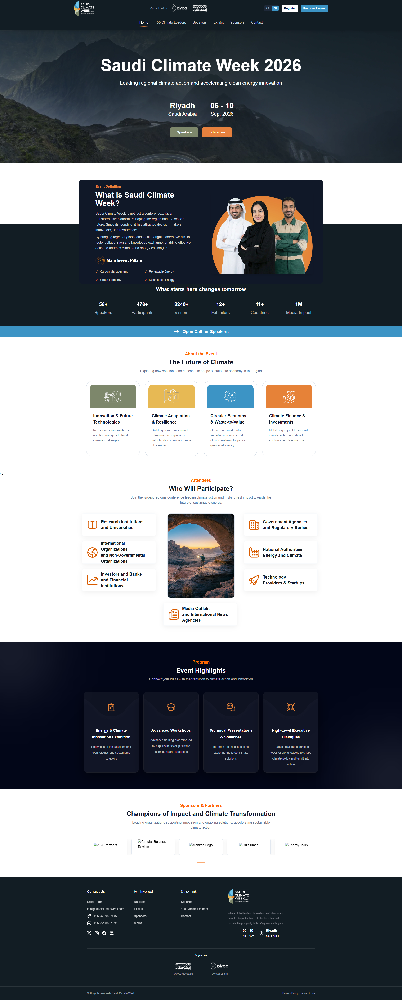
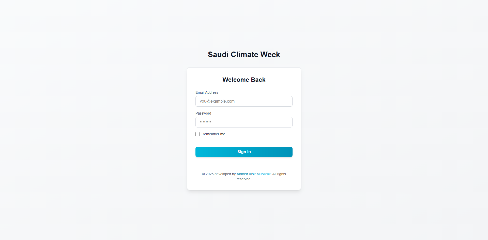
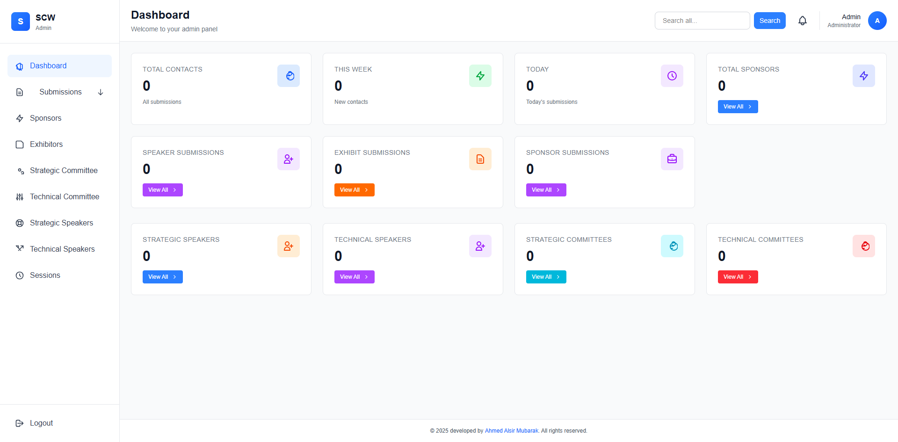
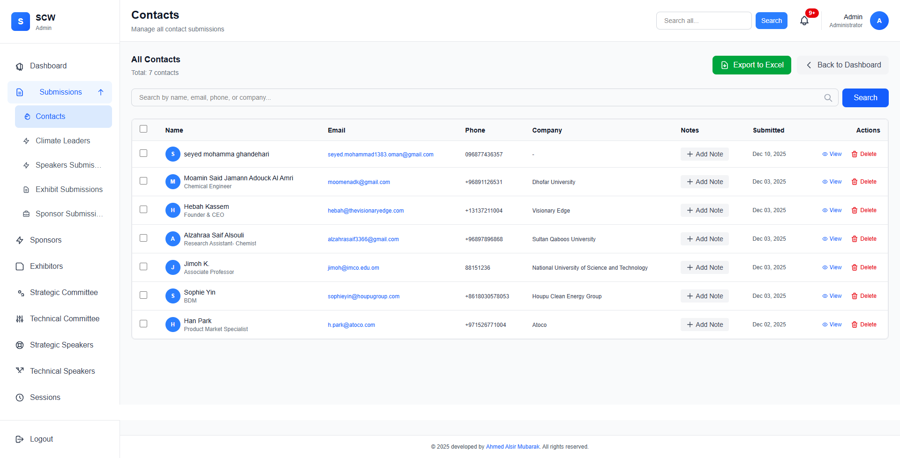
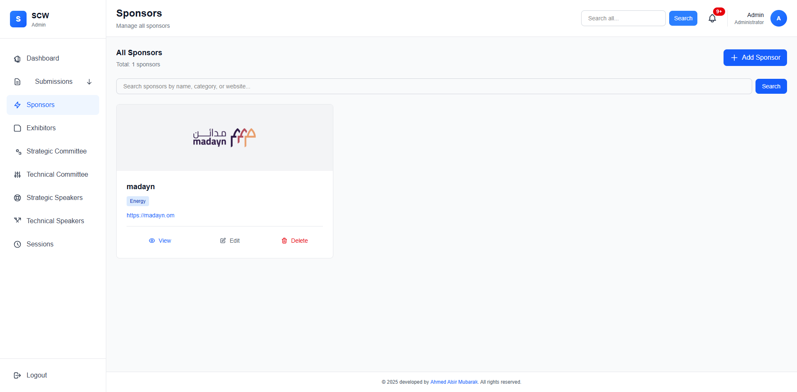
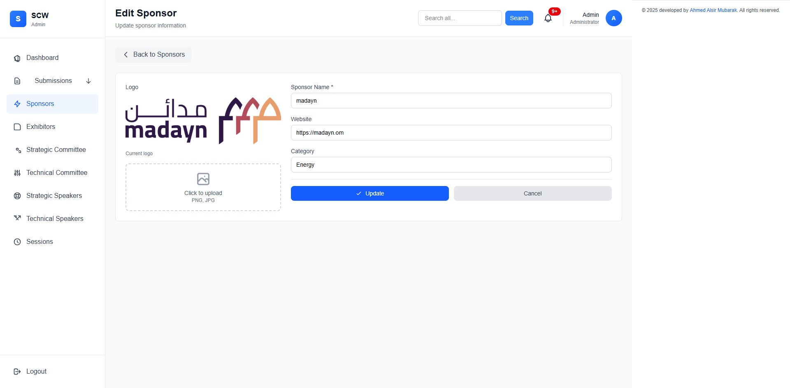
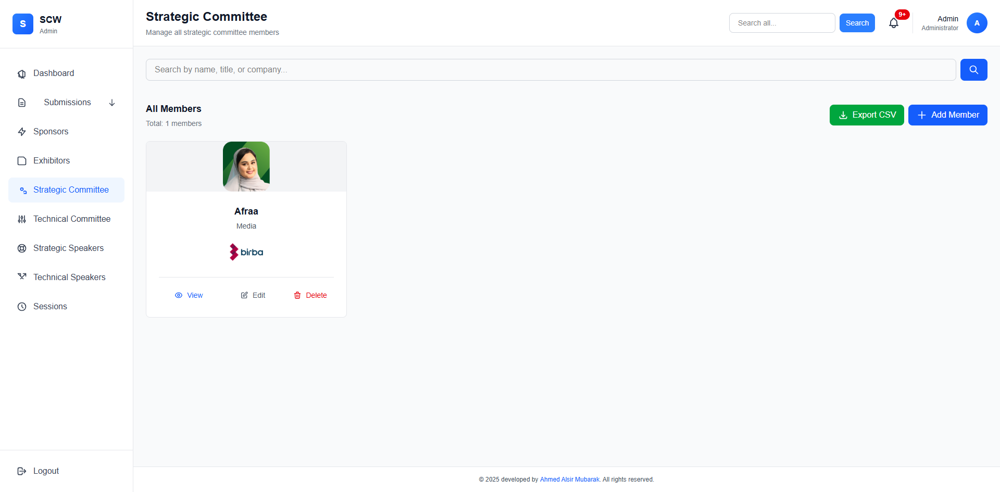
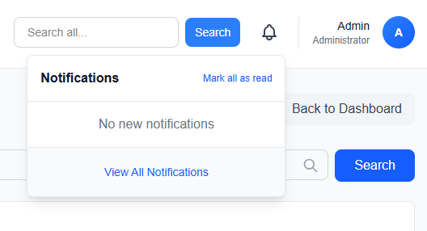

# Saudi Climate Week — SCW App

A full-stack web application for **Saudi Climate Week 2026** . It provides a public-facing event website and a private admin panel for managing submissions, sponsors, exhibitors, committee members, speakers, and sessions. its under process...

> Developed by Ahmed Alsir Mubarak · Organized by Birba

---

## Screenshots

### Public Website



---

### Admin Panel

#### Login


#### Dashboard


#### Contacts


#### Sponsors


#### Edit Sponsor


#### Strategic Committee
 (screenshots/strategic-committee-edit.png)

#### Notifications


---

## Features

### Public Website
- Multilingual support (English / Arabic)
- Event information: agenda, speakers, exhibitors, sponsors
- **100 Climate Leaders** nomination page
- Open call for speakers submission form
- Exhibit participation form
- Sponsor / become a partner form
- Contact form

### Admin Panel
- **Dashboard** — real-time stats (contacts, submissions, sponsors, speakers, committees)
- **Submissions** — contacts, speaker submissions, exhibit submissions, sponsor submissions
- **Sponsors** — full CRUD with logo upload
- **Exhibitors** — manage exhibitor profiles
- **Strategic & Technical Committees** — member cards with photo and logo upload
- **Strategic & Technical Speakers** — speaker management
- **Sessions** — event session management
- **Notifications** — real-time bell with mark-all-as-read
- **Global Search** across all records
- **Export to CSV / Excel** for contacts and submissions
- Role-based access (admin / user)

---

## Tech Stack

| Layer | Technology |
|---|---|
| Backend | Laravel 11 (PHP) |
| Frontend | Blade templates, Vite |
| Database | MySQL |
| Mail | Microsoft Graph API (Office 365) |
| Queue | Database queue driver |
| Auth | Laravel session auth with role middleware |

---

## Requirements

- PHP >= 8.2
- Composer
- Node.js >= 18 and npm
- MySQL

---

## Installation

```bash
# 1. Clone the repo
git clone <repo-url> SCW-app
cd SCW-app

# 2. Install PHP dependencies
composer install

# 3. Install JS dependencies
npm install

# 4. Copy environment file and set variables
cp .env.example .env
php artisan key:generate

# 5. Create database, then run migrations and seed
php artisan migrate --seed

# 6. Build frontend assets
npm run build

# 7. Start the development server
php artisan serve
```

---

## Environment Variables

Key variables to configure in `.env`:

```dotenv
APP_URL=http://localhost:8000

DB_CONNECTION=mysql
DB_DATABASE=scw_app
DB_USERNAME=root
DB_PASSWORD=

MAIL_MAILER=graph
GRAPH_CLIENT_ID=<your-client-id>
GRAPH_CLIENT_SECRET=<your-client-secret>
GRAPH_TENANT_ID=<your-tenant-id>
GRAPH_MAIL_FROM=
```

---

## License

(c) 2025 Saudi Climate Week. All rights reserved.
